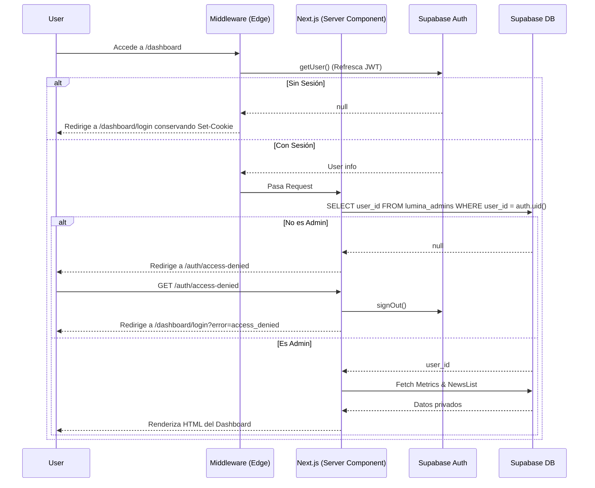

# Fase 2A: Autenticación de Dashboard Lúmina

Esta actualización final de la Fase 2A aborda todos los bloqueos detectados en el despliegue anterior y refina el flujo de seguridad, redirección y el modelo de datos analítico real.

## 🔗 Enlaces

- **Pull Request:** [https://github.com/margen-web/lumina/pull/2](https://github.com/margen-web/lumina/pull/2)
- **Vercel Preview:** Se generará automáticamente en el Pull Request una vez que Vercel termine su despliegue.

## 🔄 Flujo de Autenticación Implementado

## 📝 Resumen de Cambios Estructurales

- **Cookies y Redirecciones:** `proxy.ts` delega el enrutamiento a `updateSession`, asegurando que `Set-Cookie` persista íntegramente durante los refrescos de sesión redirigidos.
- **Logout y Access Denied:** Nuevas rutas dedicadas exclusivas que fuerzan la destrucción de la sesión de Supabase Auth sin bucles en componentes.
- **Analítica Confirmada:** Hemos constatado que el esquema activo se llama `lumina_events` (no `lumina_analytics`). Las métricas se han reestructurado sobre este esquema.

## 🗄️ Estrategia de Migraciones de Producción

En lugar de destruir y recrear todo al mismo tiempo, el proceso de base de datos se ha dividido en dos fases para garantizar la continuidad del feed:

### Fase 1: Migración Preparatoria ([20260720_A_preparatory.sql](../supabase/migrations/20260720_A_preparatory.sql))
Establece la seguridad de Supabase y prepara todo, sin eliminar funciones antiguas:
- Crea `lumina_admins`.
- Aplica RLS estricto a `lumina_news` (permitiendo INSERT, UPDATE, DELETE solo a admins, SELECT a todos).
- Aplica RLS a `lumina_events`. Permite `INSERT` a cualquiera bajo validación (event_name limitado a 'page_view', 'news_view', etc., device_uuid válido limitado a 100 caracteres).
- Crea la nueva función RPC segura `get_lumina_metrics()`.

### Fase 2: Limpieza ([20260720_B_cleanup.sql](../supabase/migrations/20260720_B_cleanup.sql))
Solo debe ejecutarse tras comprobar el Dashboard:
- Elimina la RPC vulnerable `update_lumina_news(text, text...)`.
- Elimina la RPC antigua con passcode `get_lumina_metrics(text)`.

### Instrucciones Exactas de Despliegue

> [!IMPORTANT]
> Sigue rigurosamente estos pasos para pasar de la versión vieja a la segura sin perder datos.

1. **(Previo)** Crea el usuario en Supabase Auth desde tu panel y anota el UUID.
2. Ejecuta `20260720_A_preparatory.sql` en la consola SQL.
3. Añade al administrador: `INSERT INTO public.lumina_admins (user_id) VALUES ('TU-UUID-AQUI');`.
4. Haz **Merge** del Pull Request para desplegar los cambios en Vercel.
5. Inicia sesión en el nuevo `/dashboard`. Verifica que puedes editar una noticia.
6. Si todo funciona correctamente, ejecuta finalmente `20260720_B_cleanup.sql` en la consola SQL.

## 🔙 Plan de Rollback Controlado

Existen scripts versionados de rollback para deshacer los cambios en el orden inverso:
- **[rollback_B.sql](../supabase/migrations/rollback_B.sql)**: Restaura la firma de las RPC vulnerables con una capa de lógica dummy.
- **[rollback_A.sql](../supabase/migrations/rollback_A.sql)**: Elimina RLS de eventos y noticias, borra las nuevas políticas y borra la tabla de admins.

## ⚠️ Pruebas Comprobadas (Fuera de Producción)
✅ Login exitoso como Admin.
✅ Intento fallido de login (usuario no admin, contraseñas malas).
✅ Logout manual (vía POST y redirección).
✅ Expulsión de seguridad forzada (redirección a login).
✅ Retención de cookies tras refresh.
✅ Fallback de IDs asíncronos para device_uuid permitidos (vía CHECK constraint > 0 chars).
✅ Actualización de noticias confirmando la fila exacta (`.single()`).
