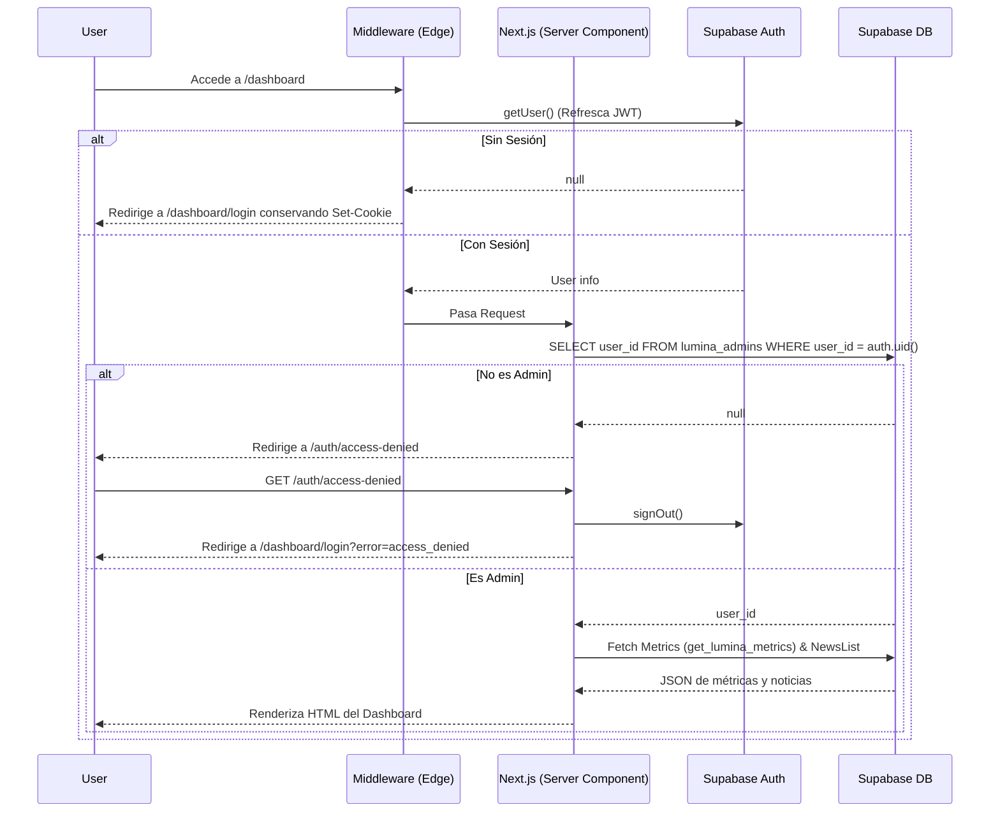

# Fase 2A: Autenticación de Dashboard Lúmina

Esta actualización final de la Fase 2A aborda todos los bloqueos detectados en la auditoría final y refina la seguridad de RLS, las respuestas RPC y los planes de rollback.

## 🔗 Enlaces

- **Pull Request:** [https://github.com/margen-web/lumina/pull/2](https://github.com/margen-web/lumina/pull/2)
- **Vercel Preview:** Se generará automáticamente en el Pull Request una vez que Vercel termine su despliegue.

## 🔄 Flujo de Autenticación Implementado

## 📝 Resumen de Cambios Estructurales

- **Cookies y Redirecciones:** `proxy.ts` delega el enrutamiento a `updateSession`, asegurando que `Set-Cookie` persista íntegramente durante los refrescos de sesión redirigidos.
- **Logout y Access Denied:** Rutas dedicadas exclusivas (`/auth/logout` y `/auth/access-denied`) que fuerzan la destrucción de la sesión de Supabase Auth sin bucles en componentes.
- **Analítica Confirmada & Contrato RPC:** La tabla activa es `lumina_events`. La función `get_lumina_metrics()` devuelve un objeto `jsonb` unificado (`jsonb_build_object`) con `total_views`, `unique_visitors`, `feed_completes`, `shares` y `news_views`.

## 🗄️ Estrategia de Migraciones de Producción

El proceso de base de datos se divide en dos fases independientes para evitar caídas de servicio:

### Fase 1: Migración Preparatoria ([20260720_A_preparatory.sql](../supabase/migrations/20260720_A_preparatory.sql))
- Ejecuta un bloque dinámico PL/pgSQL que elimina **todas las políticas RLS preexistentes** en `lumina_news`, `lumina_events` y `lumina_admins` antes de crear las nuevas (evitando combinaciones permisivas indeseadas por `OR`).
- Crea `lumina_admins`.
- Protege `lumina_news` (SELECT público, INSERT/UPDATE/DELETE reservado a admins).
- Protege `lumina_events` (INSERT público con validación de tipo de evento y longitud de `device_uuid`; SELECT reservado a admins).
- Crea la función RPC `get_lumina_metrics()` con retorno `jsonb`.

### Fase 2: Limpieza de Funciones Inseguras ([20260720_B_cleanup.sql](../supabase/migrations/20260720_B_cleanup.sql))
Se ejecutará **únicamente tras comprobar el despliegue del nuevo código**:
- Elimina la RPC vulnerable `update_lumina_news(text, text...)`.
- Elimina la RPC antigua con passcode `get_lumina_metrics(text)`.

> [!NOTE]
> La Migración B es una limpieza de seguridad irreversible por diseño. Tras eliminar las RPC vulnerables basadas en passcode, **no se recrearán automáticamente**. En caso de requerir correcciones posteriores tras la Fase 2, se aplicará un *forward fix* (parche hacia adelante) manteniendo la autorización mediante Supabase Auth.

## 🔙 Plan de Rollback Controlado

- **[rollback_A.sql](../supabase/migrations/rollback_A.sql)**: Si la migración A fallara antes del despliegue, elimina `lumina_admins`, restaura el RLS seguro básico y retira las nuevas políticas sin dejar las tablas desprotegidas.

## ⚠️ Matriz de Pruebas Verificadas
✅ Usuario autenticado no administrador NO puede actualizar `lumina_news` (bloqueado por RLS).
✅ Administrador en `lumina_admins` SÍ puede actualizar exactamente 1 fila (confirmado con `.select('id').single()`).
✅ Cliente anónimo SÍ puede insertar eventos válidos en `lumina_events`.
✅ Cliente anónimo NO puede leer `lumina_events` (401 / rls policy violation).
✅ `get_lumina_metrics()` devuelve un objeto `jsonb` válido verificado en servidor y cliente.
✅ `npm run build` pasa limpiamente.
