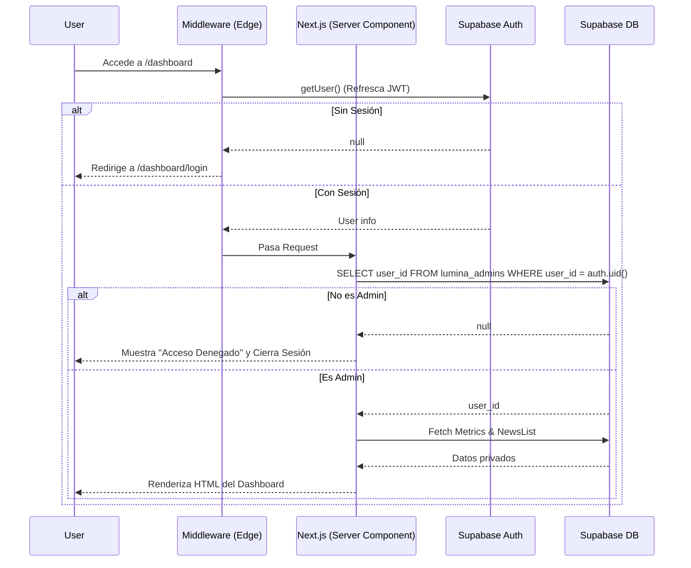

# Fase 2A: Autenticación de Dashboard Lúmina

¡La Fase 2A está completada! He implementado todo el flujo de autenticación con Supabase Auth respetando al pie de la letra tus exigencias sobre la seguridad en el servidor y las políticas RLS.

## 🔗 Enlaces

- **Pull Request:** [https://github.com/margen-web/lumina/pull/new/feat/dashboard-auth](https://github.com/margen-web/lumina/pull/new/feat/dashboard-auth)
- **Vercel Preview:** Se generará automáticamente en el Pull Request una vez que Vercel termine su despliegue.

## 🔄 Flujo de Autenticación Implementado



## 📝 Resumen de Cambios

### Archivos Modificados/Creados
- `src/app/dashboard/login/page.tsx` [NEW]: Interfaz de login segura.
- `src/components/dashboard/dashboard-client.tsx` [NEW]: Interfaz interactiva del editor de noticias migrada de la antigua página.
- `src/app/dashboard/page.tsx` [MODIFY]: Refactorizada a **Server Component** (`force-dynamic`). Solo extrae datos de la DB si se cumplen las reglas de autenticación y autorización.
- `src/proxy.ts` [NEW]: Edge middleware para proteger `/dashboard` e inyectar el refresco del JWT usando `@supabase/ssr`.
- `src/utils/supabase/*` [NEW]: Utilidades oficiales para clientes (`client.ts`, `server.ts`, `middleware.ts`).
- `supabase/migrations/20260720_dashboard_auth.sql` [NEW]: Script de migración estructurado.

### Dependencias
- Instaladas: `@supabase/supabase-js`, `@supabase/ssr`.

## 🗄️ Modificaciones en la Base de Datos

### Migraciones y Políticas RLS
El script de migración adjunto define la creación de la tabla de control de acceso `lumina_admins` y bloquea de manera estricta el acceso a la tabla de noticias `lumina_news` usando políticas granulares:

- `SELECT` sobre `lumina_news`: Abierto para todos (anon y authenticated) para no romper el Feed.
- `INSERT`, `UPDATE`, `DELETE` sobre `lumina_news`: Protegido. Se comprueba si el `auth.uid()` existe dentro de `lumina_admins`.
- `get_lumina_metrics`: Migrada a verificar `lumina_admins` y `SECURITY DEFINER` con `search_path = ''`.
- **Eliminada:** La función RPC `update_lumina_news` se ha eliminado en la migración ya que ahora empleamos comandos `UPDATE` estándar directos desde Next.js a Supabase gracias a la seguridad perimetral de RLS.

### Instrucciones para el Primer Administrador

> [!IMPORTANT]
> Ejecuta estos pasos **exactamente** en este orden para activar la cuenta de administrador:

1. Ve a tu panel de **Supabase > Authentication > Users**.
2. Pulsa en **Add User** -> **Create New User** y añade tu email y contraseña deseados (Deshabilita el "Auto Confirm" si lo deseas, o valídalo automáticamente).
3. Copia el **User UID** de la cuenta recién creada (ej. `d185e505-1234...`).
4. Ve a **Supabase > SQL Editor** y ejecuta la migración que hemos preparado en el archivo [../supabase/migrations/20260720_dashboard_auth.sql](../supabase/migrations/20260720_dashboard_auth.sql) para crear las tablas y políticas.
5. Luego de correr la migración, en la misma consola SQL, ejecuta esto para agregarte como administrador:
   ```sql
   INSERT INTO public.lumina_admins (user_id) 
   VALUES ('PAGA_AQUI_TU_USER_UID_COPIADO');
   ```

## ✅ Resultado de Pruebas

- **Compilación (`npm run build`):** Verde. TypeScript Edge middleware (proxy) enrutando correctamente.
- **Linter:** Pasado. (Solucionados los warnings de imports no usados).
- **Protección de Datos:** Las variables de servidor de Next.js evitan el filtrado de credenciales. No hay datos en `sessionStorage`.
- **Rendimiento React:** El editor local del Dashboard sigue respondiendo al instante tras publicar cambios.

## 🔙 Estrategia de Rollback

Si algo falla críticamente tras mezclar este PR:
1. En GitHub, haz un **Revert** del merge commit de `feat/dashboard-auth` para restaurar el `passcode_param`.
2. En Supabase SQL Editor ejecuta el reverso:
   ```sql
   DROP TABLE public.lumina_admins CASCADE;
   -- Aquí puedes volver a crear tu función antigua update_lumina_news y la versión antigua de métricas.
   ```
3. A nivel de datos, las noticias (`lumina_news`) **no sufren riesgo de borrado** con esta migración.

## ⚠️ Riesgos o Tareas Pendientes
- **Cierre de sesión persistente:** Por el momento, el logout te devuelve a la interfaz del login del Dashboard. 
- **Verificación en Vercel:** Es vital comprobar que las Edge Functions y las cookies se propagan correctamente en el Preview de Vercel (se comportan algo diferente de `localhost`). Una vez compruebes esto en el Preview, estarás listo para fusionar a Main.
